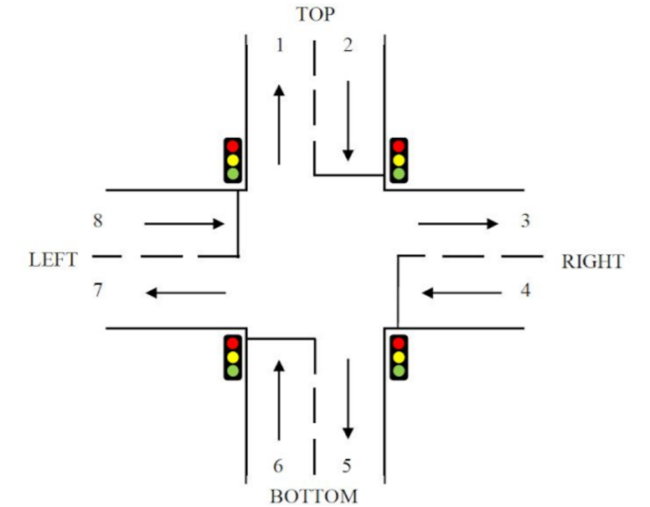

<h1>Traffic Light Control System (MCU 8051 IDE)</h1>

<h2>Operation Explanation</h2>
</img>

<h3>Step 1 : Initial phase</h3>
<ul>
    <li>All traffic lights remain red for 4 seconds.</li>
    <li>No vehicles are allowed to cross the junction.</li>
</ul>

<h3>Step 2: Top Traffic Light Phase</h3>
<ul>
    <li>The top traffic light turns green while the other traffic lights remain red.</li>
    <li>The top traffic light remains green for 8 seconds.</li>
    <li>Vehicles from route 2 can go to routes 3, 5, and 7.</li>
    <li>The top traffic light turns yellow for 2 seconds and then turns red.</li>
    <li>All traffic lights remain red for 4 seconds.</li>
</ul>

<h3>Step 3: Right Traffic Light Phase</h3>
<ul>
    <li>The right traffic light turns green while the other traffic lights remain red.</li>
    <li>The right traffic light remains green for 8 seconds.</li>
    <li>Vehicles from route 4 can go to routes 5, 7, and 1.</li>
    <li>The right traffic light turns yellow for 2 seconds and then turns red.</li>
    <li>All traffic lights remain red for 4 seconds.</li>
</ul>

<h3>Step 4: Bottom Traffic Light Phase</h3>
<ul>
    <li>The bottom traffic light turns green while the other traffic lights remain red.</li>
    <li>The bottom traffic light remains green for 8 seconds.</li>
    <li>Vehicles from route 6 can go to routes 7, 1, and 3.</li>
    <li>The bottom traffic light turns yellow for 2 seconds and then turns red.</li>
    <li>All traffic lights remain red for 4 seconds.</li>
</ul>

<h3>Step 5: Left Traffic Light Phase</h3>
<ul>
    <li>The left traffic light turns green while the other traffic lights remain red.</li>
    <li>The left traffic light remains green for 8 seconds.</li>
    <li>Vehicles from route 8 can go to routes 1, 3, and 5.</li>
    <li>The left traffic light turns yellow for 2 seconds and then turns red.</li>
    <li>All traffic lights remain red for 4 seconds.</li>
</ul>

<h2>Source Code</h2>

<a href="https://github.com/muqriqawiem/Traffic-Light-Control-System/blob/main/src/Traffic%20Light.asm">Traffic Light.asm</a>

<h2>Code Explanation</h2>

<h3>MAIN</h3>

Main part of the code where the overall control and sequencing of the traffic lights take place.

<h3>SEG</h3>

Defines a table of bytes representing different segments of a 7-segment LED display. Each byte corresponds to a specific number or character to be displayed.

<h3>SET</h3>

Sets the initial values of different timers (R1, R2, R3, R4, R5) used for controlling the delay timings during each phase of the traffic light cycle.

<h3>DELAYRED</h3>

Handles the delay and counter control during the red light phase. It decrements the R4 timer and updates the 7-segment display accordingly. The delay continues until R5 reaches zero.

<h3>DELAYGREEN</h3>

Controls the delay and counter during the green light phase. It decrements the R1 timer and updates the 7-segment display. The delay continues until R3 reaches zero.

<h3>DELAYYELLOW</h3>

Handles the delay and counter during the yellow light phase. It decrements the R2 timer and updates the 7-segment display. The delay continues until R4 reaches zero.

<h3>TOPTL, RIGHTTL, BOTTOMTL, LEFTTL</h3>

Represent the control logic for each traffic light direction (top, right, bottom, left). They call the appropriate delay functions (DELAYRED, DELAYGREEN, DELAYYELLOW) based on the specific timing requirements for each phase. The code also turns on/off the corresponding traffic lights based on the given instructions.
